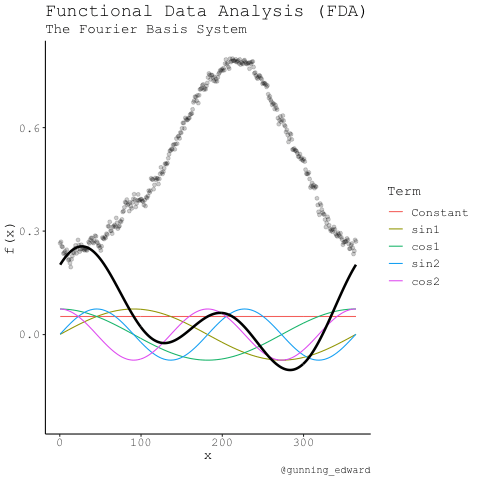
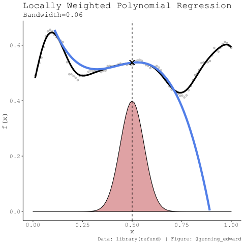
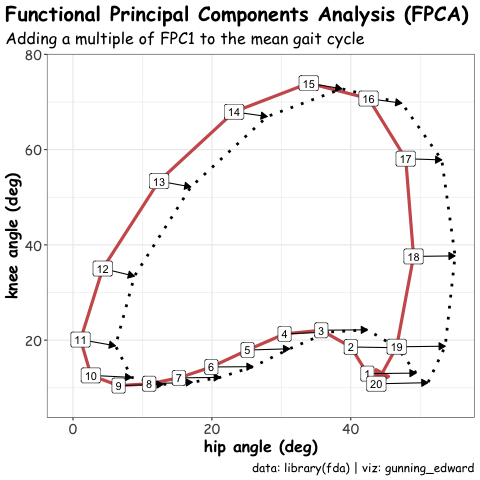
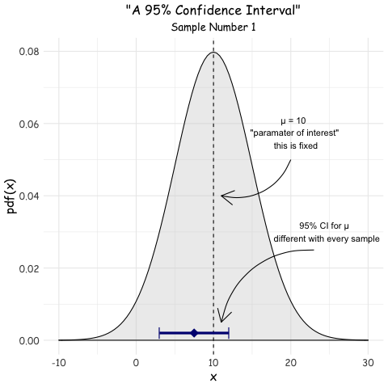

# FDA GIFs 

## It's all for fun! 

This repository is where I have some fun with the `gganimate` package to produce GIFs for some topics statistics. The idea is to use animations to describe statistical concepts that might not be intuitive through animation.

A lot of these will be related to functional data analysis (FDA), but not limited to this area. So far I've produced:

### Fourier Basis 

### Locally Weighted Polynomial Regression

### Handwriting X-Y (fda)

### Gait Cycle FPCA (fda)

### Frequentist Confidence Intervals (CI)

## More
* ideas and feedback always appreciated
* ideas for collabaration also!
* get me at edward.gunning@ul.ie